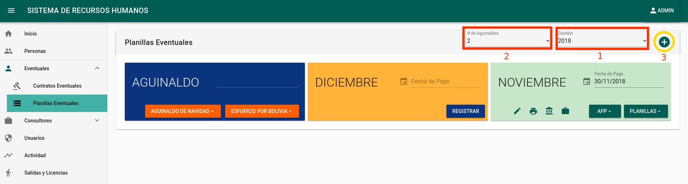

# MANUAL DE USUARIO SISTEMA DE RECURSOS HUMANOS - MUSERPO
1. INGRESO AL SISTEMA.
Este sistema es compatible con los navegadores Firefox y Chrome, para acceder al sistema se debe acceder al enlace:
[http://rrhh.muserpol.gob.bo](http://rrhh.muserpol.gob.bo).
Una vez dentro se deben ingresar las credenciales en los campos de usuario y contraseña adquiridas por el responsable de la Unidad de Sistemas y Soporte Técnico.

* CAMBIO DE CONTRASEÑA.
La primera acción a tomar es cambiar la contraseña, para ello debe hacer click en el botón llamado ADMIN ubicado en la parte superior derecha de la ventana, esta acción abrirá el menú lateral:

A continuación debe hacer click en la opción de Perfil que se muestra a continuación.

Debe llenar el formulario que aparecerá en la nueva ventana, con lo cual, tras Guardar tendrá cambiada su contraseña.

* CERRAR SESION. Para salir de la sesión actual bastará con hacer click en la opción Cerrar Sesión.

2. GESTION DE EMPLEADOS. Para la gestión de empleados deberá hacer clic en la siguiente opción.

* LISTADO DE EMPLEADOS. Luego podrá ver un listado de todos los empleados como se ve a continuació

* CREAR UN NUEVO EMPLEADO. Para crear un nuevo empleado debe hacer clic en el botón ubicado en la esquina superior derecha como se muestra a continuación.

Luego el sistema desplegará un formulario con todos los campos correspondientes los cuales deberán ser llenados por el usuario:

* VER DETALLES DE EMPLEADO. Cada registro de empleado cuenta con múltiples opciones, una de ellas es poder VER el detalle su información solanmente haciendo click en la fila correspondiente, como se muestra a continuación.

* EDITAR REGISTRO DE EMPLEADO. Otra de las funcionalidades del sistema es poder editar la información registrada de los empleados y se realiza haciendo clic en el botón editar ubicado en la parte final derecha de cada registro.

Una vez presionado el botón se desplegará el formulario con los campos correspondientes habilitados para su edición como se muestra a continuación.

Una vez realizados los cambios necesarios a los datos del empleado respectivo se procede a  guardar haciendo clic en el botón guardar ubicado en la esquina inferior derecha.

* CAMBIAR ESTADO DEL EMPLEADO. Cuando un empleado es dado de baja o ya no forma parte de la relación laboral se procede a “desactivarlo” simplemente cambiando el switch de ON(Estado activo) a OFF(Estado inactivo) como vemos a continuación.

* BUSQUEDA

El sistema también otorga al usuario una funcionalidad de búsqueda o filtrado de información para poder encontrar datos de forma rápida, la barra de búsqueda se encuentra ubicada en la esquina superior derecha de cada tabla como se ve a continuación.

Puede introducir cualquier parametro de busqueda ya sea nombre, carnet, cuenta, etc.

3. CONTRATOS. Para ingresar a la ventana de contratos debe hacer click en el siguiente ícono de la barra lateral izquierda:

* CREAR UN CONTRATO. Para esta operación es necesario tener registrado correctamente al empleado, como se mencionó en el punto 2.2.

Esta operación abrirá la ventana de Crear Contrato:

Debe ingresar todos los campos obligatorios. Al lado derecho se observan algunos datos útiles para verificar la correcta generación del contrato.

* RENOVAR CONTRATOS. 

La opción de renovar contratos aplica cuando se desea renovar un contrato caducado o pronto a caducar.

Se pueden seleccionar los contratos a renovar, a los cuales se asignarán nuevos contratos de acuerdo a la Fecha de Inicio y Fecha de Conclusión ingresadas, para guardar los cambios se debe hacer click en el botón Registra.

* IMPRIMIR REGISTROS

La opción abre el submenú de Impresión

 

Afiliación al seguro: Imprime la boleta de afiliación al seguro de la C.N.S. (Para esta opción es necesario contar con los formularios de alta proporcionados por la propia caja aseguradora)
Baja del asegurado: Imprime la boleta de baja del seguro de la C.N.S. (Para esta opción es necesario contar con los formularios de alta proporcionados por la propia caja aseguradora)
Contrato: Imprime el contrato generado de acuerdo a los datos ingresados en el punto 3.1.

* VER DETALLES DE CONTRATO. Simplemente hacer click sobre el contrato

 

* EDITAR CONTRATO

Esta ventana tiene los mismos campos de edición que el formulario de creación de contrato.

* ELIMINAR CONTRATO.

Al ejecutar esta acción se abrirá una ventana de confirmación.

Una vez confirmada la acción no tiene retorno, por lo cual el usuario debe estar totalmente seguro de eliminar el contrato seleccionado.

4. PLANILLAS. La opción de añadir un nuevo mes estará habilitada para meses no generados o para el mes anterior, es decir si actualmente se encuentra en el mes de Agosto, este botón generará un nuevo registro para las planillas del mes de Julio.

Una vez generado el mes, se deben registrar las planillas mediante el botón Registra.

* EDITAR LA NUEVA PLANILLA

Los campos que se pueden editar en esta ventana son:
de dias NO Trabajados
RC-IVA 13%
Descuentos por Atrasos, Abandonos, Faltas y Licencia S/G Haberes
Saldo mes anterior (Form A-3 Tributario)
Al cambiar estos valores, todas las columnas dependientes de cada uno serán actualizadas y recalculadas automáticamente. Para finalizar se debe presionar el botón de Guardar

* EDICION DE LAS PLANILLAS. Solo se pueden editar las planillas registradas, para ello se debe utilizar la opción Editar.

Al igual que en el paso anterior, esta ventana solo tiene habilitados para su edición los campos de:

de dias NO Trabajados.

RC-IVA 13%.

Descuentos por Atrasos, Abandonos, Faltas y Licencia S/G Haberes.

Saldo mes anterior (Form A-3 Tributario).

* DESCARGAR PLANILLAS

Hoja de cálculos de Excel: Descarga la planilla de haberes en formato XLS.

Imprimir boletas de pago: Imprime las boletas de pago del mes.

TXT: Descarga el archivo TXT que se utiliza para el pago de haberes en el banco.

OVT: Descarga el archivo CSV requerido para el registro en el sistema del Ministerio de trabajo https://ovt.mintrabajo.gob.bo.

Planillas: Genera los diferentes PDFs que se listan a continuación.

Esta lista incluye las Planillas de Haberes (H.) y las Planillas Patronales (P.) en diferentes listas.

5. REPORTES.

