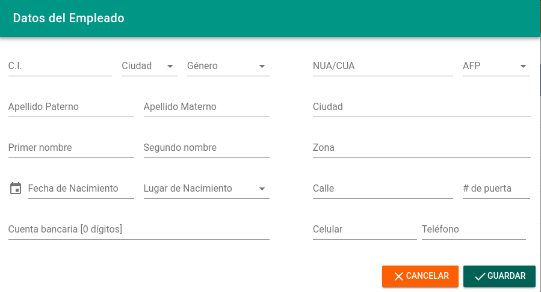
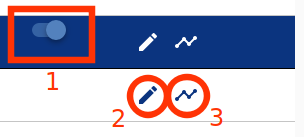
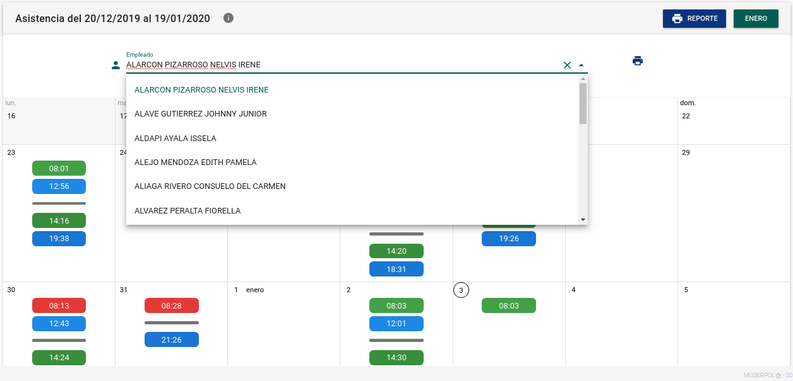
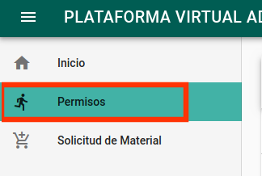
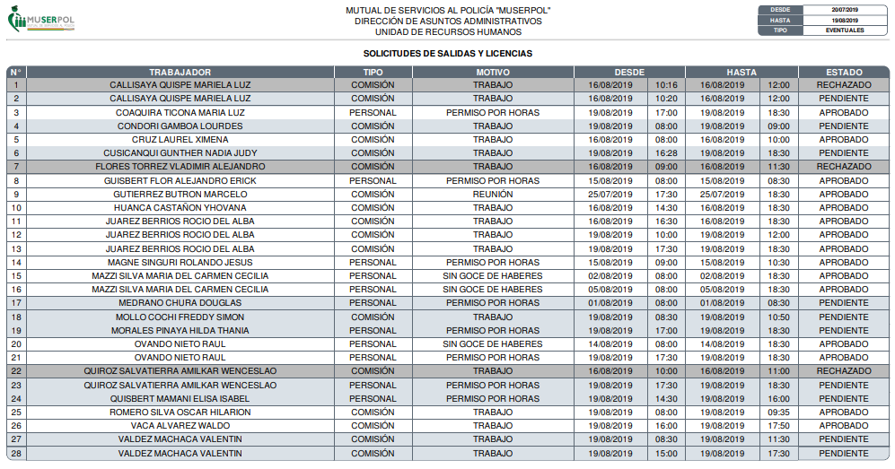
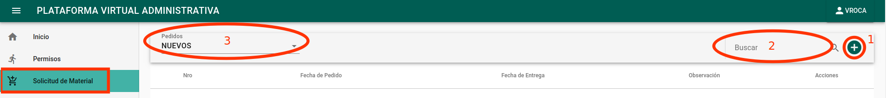
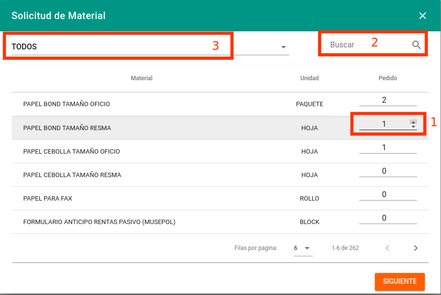
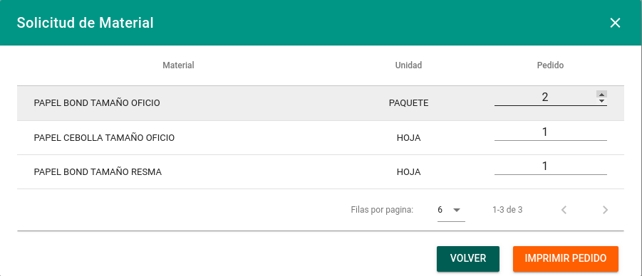
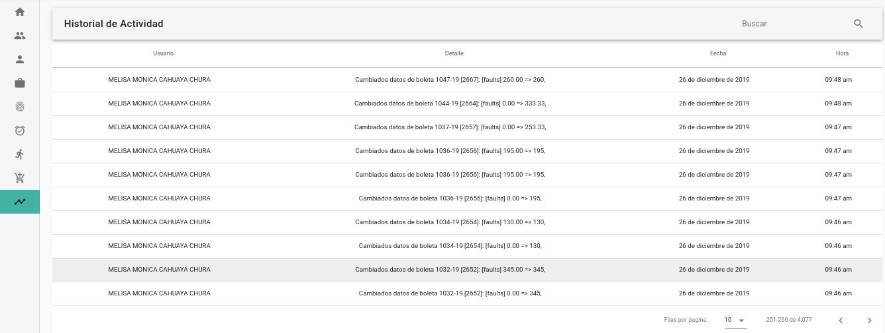

# MANUAL DE USUARIO DE PLATAFORMA VIRTUAL ADMINISTRATIVA - MUSERPOL

## INGRESO AL SISTEMA.

Este sistema es compatible con los navegadores Firefox y Chrome, para acceder al sistema se debe acceder al enlace:
[http://pva.muserpol.gob.bo](http://pva.muserpol.gob.bo).
Una vez dentro se deben ingresar las credenciales en los campos de usuario y contraseña adquiridas por el responsable de la Unidad de Sistemas y Soporte Técnico.

#### CAMBIO DE CONTRASEÑA

La primera acción a tomar es cambiar la contraseña proporcionada por el responsable de la Unidad de Sistemas y Soporte Técnico, esta acción se debe ejecutar en la [Intranet de la institución](intranet.muserpol.gob.bo):

A continuación debe hacer click en la opción de *CAMBIAR CONTRASEÑA* y llenar los campos requeridos.

Debe llenar el formulario que anterior, de la siguiente manera:

- **1)** Nombre de usuario, por ejemplo para Juan Pérez el usuario será jperez (este nombre de usuario es otorgado por el responsable de la Unidad de Sistemas y Soporte Técnico)
- **2)** Contraseña otorgada por el responsable de la Unidad de Sistemas y Soporte Técnico
- **3)** Nueva contraseña
- **4)** Confirmación de la nueva contraseña

#### CAMBIO DE CONTRASEÑA PARA EL ADMINISTRADOR

Después del login, debe hacer click en el botón ubicado en la parte superior derecha de la ventana con el nombre de usuario ADMIN, esta acción abrirá el menú lateral:

A continuación debe hacer click en la opción de Perfil que se muestra a continuación.

Debe llenar el formulario que aparecerá en la nueva ventana, con lo cual, tras Guardar tendrá cambiada su contraseña.

#### CERRAR SESION

Para salir de la sesión actual bastará con hacer click en la opción Cerrar Sesión del menú superior derecho.

## ESTADÍSTICAS

Esta primera ventana muestra el resumen de:

* Personal eventual activo e inactivo, y nuevos ingresos y bajas del mes
* Consultores activos e inactivos, y nuevos ingresos y bajas del mes
* Personal sin contrato o con contrato vencido
* Recaudación del fondo social y detalle mensual hasta la fecha de acuerdo a las planillas generadas
* Cumpleañeros del mes

Cada resumen tiene la opción de descarga en formato CSV editable como hoja de cálculo.

## GESTIÓN DE PERSONAL

Esta vista contiene las siguientes opciones:

- **1)** Filtro de empleados según contrato, eventuales, consultores y sin contrato actual.

- **2)** Filtro de empleados activos e inactivos
- **3)** Caja de búsqueda de acuerdo a los campos mostrados en la lista
- **4)** Opción para registrar una nueva persona

Cada registro de empleado cuenta con múltiples opciones, una de ellas es poder VER el detalle la información con solo hacer click en la fila correspondiente, como se muestra a continuación.

Por otra parte, cada registro cuenta con 4 opciones:

- **1)** Dar de baja a un funcionario, éste registro será visible en la pestaña de *INACTIVOS*
- **2)** Editar los datos del funcionario
- **3)** Imprimir el Certificado de Haberes y Aportes Laborales

La lista de empleados cuenta con un código de 4 colores que ayuda a completar el llenado de datos en los casos faltantes:

- **AZUL**: EL funcionario no tiene contratos registrados en el sistema, solo en este caso el registro puede ser eliminado
- **AMARILLO**: EL funcionario no tiene los datos adicionales registrados
- **ROJO**: El funcionario no tiene cuenta bancaria o número NUA/CUA registrados
- **BLANCO**: el funcionario cuenta con todos los datos registrados

## GESTIÓN DE PERSONAL EVENTUAL

### GESTIÓN DE CONTRATOS DE PERSONAL EVENTUAL

En la pestaña de contratos eventuales se despliegan 4 opciones:

- **1)** Filtro para mostrar contratos activos o inactivos
- **2)** Búsqueda de acuerdo a los parámetros mostrados en pantalla
- **3)** Crear nuevo contrato

- **4)** Acciones que contemplan:

  * Impresión de contrato, alta y baja del seguro
  * Recontratar personal
  * Editar contrato
  * Eliminar, visible solo en caso de que el contrato no figure en ninguna planilla

### GESTIÓN DE PLANILLAS DE PERSONAL EVENTUAL

Esta pestaña cuenta con las siguientes opciones:

- **1)** Gestión actual
- **2)** Número de aguinaldos de la gestión
- **3)** Añadir una planilla manualmente (opción habilitada solo para el rol de administrador)

Por defecto las planillas están habilitadas para registrarse cada nuevo mes, siempre y cuando las planillas anteriores se encuentren cerradas.

A continuación se muestra la lista de planillas de cada mes de la gestión seleccionada. Esta vista cuenta con un código de colores para identificar de manera óptima el estado de las planillas:

* **AZUL**: Planilla(s) de aguinaldos, solo se muestra si se registraron el número de aguinaldos para la gestión actual.
* **AMARILLO**: Planilla abierta o lista para registrar.
* **VERDE**: Planilla generada y cerrada, la edición ya no es posible una vez que la planilla ha sido cerrada.

Las planillas mensuales cuentan con las opciones de:

* Editar Planilla (Para planillas abiertas)
* Ver Planilla (Para planillas cerradas)
* Imprimir boletas de pago
* Imprimir boleta de pago separada
* Descargar archivo TXT para débito automático en Banco
* Descargar archivo CSV para declaración en la [Oficina Virtual de Trámites del Ministerio de Trabajo](https://ovt.mintrabajo.gob.bo)
* Reporte de pago de refrigerios y enlace TXT para pago automático en banco
* Descargar registro de novedades para las AFPs
* Imprimir planillas filtradas de acuerdo a los formatos establecidos en MUSERPOL

Las planillas de aguinaldo cuentan con las opciones de:

* Imprimir planillas
* Imprimir boletas de pago
* Descargar archivo TXT para débito automático en Banco
* Descargar archivo CSV para declaración en la [Oficina Virtual de Trámites del Ministerio de Trabajo](https://ovt.mintrabajo.gob.bo)
* Editar fecha de pago y nombre de Planilla
* Eliminar Planilla (opción solo disponible para el rol administrador)

#### EDICIÓN DE PLANILLAS

Para la edición de una planilla mensual se debe registrar el mes a pagar haciendo click en el botón **REGISTRAR**

A continuación se debe definir los días laborales del mes para ser contados en el reporte de refrigerios:

Ahora se puede proceder a editar la planilla del mes generado. Para ello se debe hacer click en el botón editar.

Esto nos llevará a la gestión de la planilla.

La edición de planillas contempla el registro de:

* Días NO trabajados
* RC-IVA
* Descuentos por Atrasos, Abandonos, Faltas y Licencia S/G Haberes
* Saldo tributario del mes anterior (para formulario A-3)

Al registrar cualquiera de estos valores bastará con pulsar la tecla *ENTER* para que sean guardados. Alternativamente se puede llenar toda una fila y pulsar el botón *GUARDAR*.

Las opciones de Eliminar Planilla y Eliminar Registro están habilitadas solo para el rol de administrador. La última de estas opciones abre un formulario:

La impresión de Planillas incluye las Planillas de Haberes (H.) y las Planillas Patronales (P.) agrupadas de acuerdo al criterio actual de MUSERPOL.

## GESTIÓN DE CONSULTORES

### GESTIÓN DE CONTRATOS DE CONSULTORES

El listado de contratos de consultores cuenta con las siguientes opciones:

- **1)** Filtro para listar los contratos activos o inactivos
- **2)** Caja de búsqueda de acuerdo a los parámetros mostrados en pantalla
- **3)** Botón para añadir nuevos contratos

Este formulario contiene los siguientes campos:

* CI de empleado
* Puesto que puede ser reutilizado o en caso de no existir el puesto para la consultoría este campo es editable a fin de generar un nuevo cargo
* Haber básico de acuerdo a la escala salarial vigente en MUSERPOL
* Unidad que requiere la consultoría
* Fecha de inicio de la consultoría
* Fecha de conclusión de la consultoría
* Cite o número de contrato
* Cite y fecha de cite de recursos humanos
* Horario de trabajo

En el panel derecho de la ventana se puede ver un resumen del total ganado y la suma de días trabajados por cada mes del tiempo de contrato.

### GESTIÓN DE CONTRATOS DE CONSULTORES

Esta pestaña cuenta con las mismas opciones que el módulo de planillas de personal eventual pero con la diferencia de que tan solo se pueden descargar:

- **1)** Archivo TXT para débito automático en banco
- **2)** Detalle de planilla en formato PDF con listado de personal que disponde de cuenta bancaria
- **3)** Detealle de planilla en formato PDF con listado de todos los consultores

## REGISTRO DE ASISTENCIA

En la pantalla inicial se encuentra habilitado un ícono con el título "REGISTRO DE ASISTENCIA" que sirve de acceso directo para navegar hasta la ventana de la lista de registros de asistencia.

### LISTA DE REGISTROS DE ASISTENCIA MENSUAL

En esta ventana se visualizan los registros de asistencia o marcado por día en un calendario que discrimina la asistencia por mes de acuerdo al rango de fechas especificado por el personal de Recursos Humanos; es decir, por ejemplo para el mes de Junio se toman en cuenta los registros desde el día 20 del mes de Mayo hasta el día 19 del mes de Junio. Los registros posteriores al 20 de cada mes son tomados en cuenta para el siguiente mes.

Los registros marcados en rojo indican un retraso en el ingreso, los registros en verde indican el ingreso antes de la hora definida como atraso, los registros azules indican las salidas, los registros amarillos indican los marcados que no concuerdan con el ingreso o salida, es decir no están dentro de horarios establecidos. Por último la línea ploma divide los registros del primer y el segundo turno laborales.

Para verificar registros antiguos basta con seleccionar el mes deseado en el botón verde superior derecho.

### LISTA DE REGISTROS DE ASISTENCIA POR EMPLEADO

Los funcionarios con rol de Recursos Humanos pueden además seleccionar cualquier funcionario de la lista de funcionarios activos a fin de obtener la lista de registros de asistencia, en este caso también está disponible la selección del mes.

- **1)** Imprime los registros de asistencia del personal eventual o consultor de acuerdo a la selección de un rango de fechas
- **2)** Imprime los registros de asistencia del mes solo del funcionario seleccionado

### CONFIGURACIÓN DE HORARIOS DE TRABAJO

Para el correcto funcionamiento y visualización de registros de asistencia es necesario configurar los límites de cada horario de trabajo establecido en la base de datos, así como los días laborales de acuerdo a los contratos emitidos por la institución.

### SINCRONIZACIÓN DE REGISTROS DE ASISTENCIA

El usuario administrador puede sincronizar los datos de los dispositivos biométricos con la base de datos y a su vez borrar dichos registros a fin de evitar el desbordamiento de las bases de datos de cada dispositivo biométrico.

## SALIDAS Y LICENCIAS

### SOLICITUD DE SALIDAS Y LICENCIAS

Seleccione la opción de salidas y licencias como se muestra en la siguiente imagen:

Seleccione la opción de nueva solicitud, aparecera el siguiente formulario donde deberá llenar la informacion correspondeinte a la solicitud:

- **1)** Horas restantes del mes en curso.
- **2)** Días restantes del año en curso.
- **3)** Solicitar salida o licencia.
- **4)** Filtro de visualización de solicitudes del mes en curso o todas.
- **5)** Imprimir solicitud o nota dependiendo del tipo de solicitud.
- **6)** Editar CITE y/o DETALLE de solicitud, no visible para solicitudes aceptadas o rechazadas.
- **7)** Eliminar solicitud, solo disponible en caso de solicitudes pendientes, no visible para solicitudes aceptadas o rechazadas.

Para solicitar una salida o licencia llenar el siguiente formulario divido en dos pasos:

- **1)** Seleccione el tipo de permiso.
- **2)** Seleccione la razón de la solicitud.
- **3)** Pulse el botón siguiente para pasar al paso 2.

Seleccione las opciones de acuerdo a su solicitud y proceda a imprimir la solicitud. La impresión debe realizarse en una hoja tamaño oficio, está será dividida en tres a fin de obtener un ejemplar para el solicitante, otra para el personal de Recursos Humanos y otra para constancia en caso de ser presentada para devolución de pasajes con Caja Chica.

Si la solicitud debe ser presentada mediante nota al Director General Ejecutivo, se generará una carta prediseñada lista para su presentación.

Una vez solicitada la licencia o permiso debe adjuntar el respaldo (en caso de existir) y dirigirse a la Unidad de Recursos Humanos con la documentación correspondiente para que la solicitud sea aprobada.

### ADMINISTRACIÓN DE SALIDAS Y LICENCIAS

Seleccione la opción de "Aprobar Permisos" que mostrará la siguiente vista:

Aquí se muestra un listado de todas las solicitudes generadas, para aprobar basta con cambiar el interruptor ubicado en la parte derecha de cada solicitud. El código de colores que se muestra en la pestaña de información es el siguiente:

* **AMARILLO**: Solicitudes pendientes de aprobación o rechazo.
* **ROJO**: Solicitudes rechazadas.
* **AZUL**: Solicitud seleccionada.
* **BLANCO**: Solicitudes aprobadas.

El botón *REPORTE* imprime un reporte de las solicitudes generadas entre el día 20 del mes anterior y el día 19 del mes en curso.

## ALMACENES

### SOLICITUDES DE PEDIDOS DE ALMACÉN

Seleccione la opción de `Solicitud de Material` del menú lateral, la cual le mostrara la siguiente vista:

- **1)** Generar nueva solicitud de material.
- **2)** Búsqueda de solicitud.
- **3)** Filtro de pedidos *NUEVOS*, *ENTREGADOS* y *CANCELADOS*.

### GENERAR SOLICITUD

Seleccione la botón `+` el cual le mostrara el siguiente formulario:

- **1)** Cantidad de artículos pedidos.
- **2)** Buscador por nombre.
- **3)** Filtro de artículos agrupados por tipo.

Una vez seleccionada la cantidad de artículos del pedido (15 artículos como máximo) se continua al siguiente paso.

En este formulario se mostrarán todos los artículos pedidos y las cantidades (aún se pueden modificar). Para eliminar un artículo bastará con reducir la cantidad pedida a `0`.

La impresión debe realizarse en una hoja tamaño oficio, está será dividida en dos a fin de obtener un ejemplar para el solicitante y otro para el encargado de almacén.

### REGISTRAR ENTREGA DE MATERIAL

Esta opción solo está disponible para el encargado de almacén.

- **1)** Registrar entrega de materiales solicitados.
- **2)** Filtro de solicitudes *NUEVAS*, *ENTREGADAS* y *CANCELADAS*.

Para registrar la entrega de materiales o anular la solicitud se debe presionar el botón de Entrega en la parte de derecha de cada solicitud, esto abrirá un formulario:

- **1)** Anular solicitud.
- **2)** Cambiar cantidad entregada.
- **3)** Registrar e imprimir entrega.

La impresión debe realizarse en una hoja tamaño oficio, está será dividida en dos a fin de obtener un ejemplar para el solicitante y otro para el encargado de almacén.

### STOCK DE MATERIALES

Esta opción solo está disponible para el encargado de almacén.

- **1)** Buscar material por nombre.
- **2)** Filtro de materiales por grupo.

## ADMINISTRACIÓN DE USUARIOS

Gestión de roles para cada cuenta de usuario con acceso al sistema, esta lista es generada mediante la lista de usuarios disponible en el servidor de identificación centralizada LDAP.

## REGISTRO DE ACTIVIDADES

Cada acción generada por los usuarios es guardada como respaldo de la actividad en caso de ser necesaria la evidencia de los cambios que realizó algún usuario.

## CONFIGURACIÓN DE DATOS INSTITUCIONALES

Para la correcta impresión del nombre de la institución, así como su acrónimo y datos adicionales, es necesario configurar los datos institucionales; entre otros, la resolución y fecha de designación de la máxima autoridad ejecutiva.

