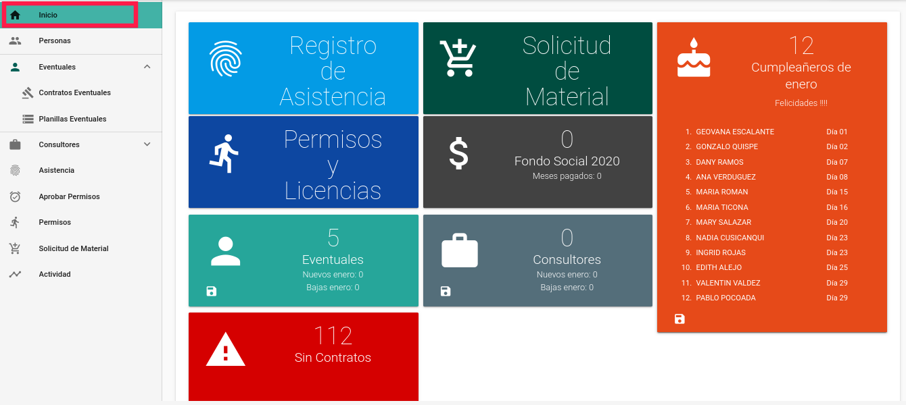
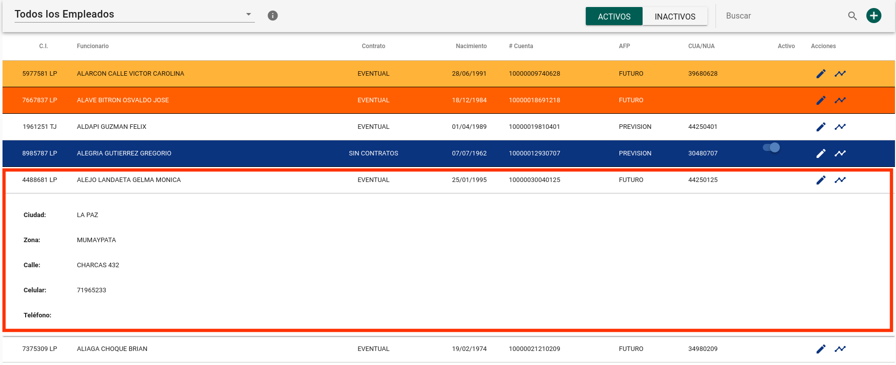
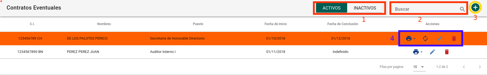
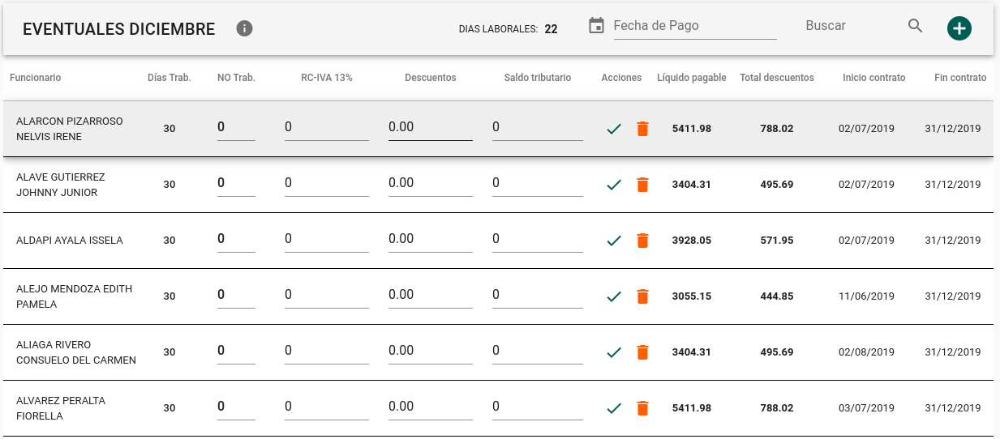

# MANUAL DE USUARIO SISTEMA DE RECURSOS HUMANOS - MUSERPOL

## INGRESO AL SISTEMA.

Este sistema es compatible con los navegadores Firefox y Chrome, para acceder al sistema se debe acceder al enlace:
[http://rrhh.muserpol.gob.bo](http://rrhh.muserpol.gob.bo).
Una vez dentro se deben ingresar las credenciales en los campos de usuario y contraseña adquiridas por el responsable de la Unidad de Sistemas y Soporte Técnico.

#### CAMBIO DE CONTRASEÑA

La primera acción a tomar es cambiar la contraseña proporcionada por el responsable de la Unidad de Sistemas y Soporte Técnico, esta acción se debe ejecutar en la [Intranet de la institución](intranet.muserpol.gob.bo):

A continuación debe hacer click en la opción de *CAMBIAR CONTRASEÑA* y llenar los campos requeridos.

Debe llenar el formulario que anterior, de la siguiente manera:

- **1)** Nombre de usuario, por ejemplo para Juan Pérez el usuario será jperez (este nombre de usuario es otorgado por el responsable de la Unidad de Sistemas y Soporte Técnico)
- **2)** Contraseña otorgada por el responsable de la Unidad de Sistemas y Soporte Técnico
- **3)** Nueva contraseña
- **4)** Confirmación de la nueva contraseña

#### CAMBIO DE CONTRASEÑA PARA EL ADMINISTRADOR

Después del login, debe hacer click en el botón ubicado en la parte superior derecha de la ventana con el nombre de usuario ADMIN, esta acción abrirá el menú lateral:

A continuación debe hacer click en la opción de Perfil que se muestra a continuación.

Debe llenar el formulario que aparecerá en la nueva ventana, con lo cual, tras Guardar tendrá cambiada su contraseña.

#### CERRAR SESION

Para salir de la sesión actual bastará con hacer click en la opción Cerrar Sesión del menú superior derecho.

## ESTADÍSTICAS

Esta primera ventana muestra el resumen de:

* Personal eventual activo e inactivo, y nuevos ingresos del mes
* Consultores activos e inactivos, y nuevos ingresos del mes
* Personal sin contrato actual
* Recaudación del fondo social hasta la fecha de acuerdo a las planillas generadas
* Cumpleañeros del mes

Cada resumen tiene la opción de descarga en formato CSV editable como hoja de cálculo.

## GESTIÓN DE PERSONAL

Esta vista contiene las siguientes opciones:

- **1)** Filtro de empleados según contrato, eventuales, consultores y sin contrato actual.

- **2)** Filtro de empleados activos e inactivos
- **3)** Caja de búsqueda de acuerdo a los campos mostrados en la lista
- **4)** Opción para registrar una nueva persona

Cada registro de empleado cuenta con múltiples opciones, una de ellas es poder VER el detalle la información con solo hacer click en la fila correspondiente, como se muestra a continuación.

Por otra parte, cada registro cuenta con 4 opciones:

- **1)** Dar de baja a un funcionario, éste registro será visible en la pestaña de *INACTIVOS*
- **2)** Editar los datos del funcionario
- **3)** Eliminar registro (siempre y cuando no se encuentre registrado en planillas ni contratos)
- **4)** Imprimir el Certificado de Haberes y Aportes Laborales

La lista de empleados cuenta con un código de 4 colores que ayuda a completar el llenado de datos en los casos faltantes:

- **AZUL**: EL funcionario no tiene contratos registrados en el sistema, solo en este caso el registro puede ser eliminado
- **AMARILLO**: EL funcionario no tiene los datos adicionales registrados
- **ROJO**: El funcionario no tiene cuenta bancaria o número NUA/CUA registrados
- **BLANCO**: el funcionario cuenta con todos los datos registrados

## GESTIÓN DE PERSONAL EVENTUAL

### GESTIÓN DE CONTRATOS DE PERSONAL EVENTUAL

En la pestaña de contratos eventuales se despliegan 4 opciones:

- **1)** Filtro para mostrar contratos activos o inactivos
- **2)** Búsqueda de acuerdo a los parámetros mostrados en pantalla
- **3)** Crear nuevo contrato

- **4)** Acciones que contemplan:

  * Impresión de contrato, alta y baja del seguro
  * Recontratar personal
  * Editar contrato
  * Eliminar, válido solo en caso de que el contrato no figure en ninguna planilla

### GESTIÓN DE PLANILLAS DE PERSONAL EVENTUAL

Esta pestaña cuenta con las siguientes opciones:

- **1)** Gestión actual
- **2)** Número de aguinaldos de la gestión
- **3)** Añadir una planilla manualmente (opción habilitada solo para el rol de administrador)

Por defecto las planillas están habilitadas para registrarse cada nuevo mes, siempre y cuando las planillas anteriores se encuentren cerradas.

A continuación se muestra la lista de planillas de cada mes de la gestión seleccionada. Esta vista cuenta con un código de colores para identificar de manera óptima el estado de las planillas:

* **AZUL**: Planilla(s) de aguinaldos, solo se muestra si se registraron el número de aguinaldos para la gestión actual.
* **AMARILLO**: Planilla abierta o lista para registrar.
* **VERDE**: Planilla generada y cerrada, la edición ya no es posible una vez que la planilla ha sido cerrada.

Las planillas mensuales cuentan con las opciones de:

* Editar Planilla
* Imprimir boletas de pago
* Descargar archivo TXT para débito automático en Banco
* Descargar archivo CSV para declaración en la 
* Descargar registro de novedades para las AFPs
* Imprimir planillas filtradas de acuerdo a los formatos establecidos en MUSERPOL

Las planillas de aguinaldo cuentan con las opciones de:

* Imprimir planillas
* Descargar archivo TXT para débito automático en Banco
* Descargar archivo CSV para declaración en la 
* Editar fecha de pago y nombre de Planilla
* Eliminar Planilla (opción solo disponible para el rol administrador)

#### EDICIÓN DE PLANILLAS

La edición de planillas contempla el registro de:

* Días NO trabajados
* RC-IVA
* Descuentos por Atrasos, Abandonos, Faltas y Licencia S/G Haberes
* Saldo tributario del mes anterior (para formulario A-3)

Al registrar cualquiera de estos valores bastará con pulsar la tecla *ENTER* para que sean guardados. Alternativamente se puede llenar toda una fila y pulsar el botón *GUARDAR*.

Las opciones de Eliminar Planilla, Eliminar Registro y Añadir un Nuevo Registro están habilitadas solo para el rol de administrador. La última de estas opciones abre un formulario

La impresión de Planillas incluye las Planillas de Haberes (H.) y las Planillas Patronales (P.) agrupadas de acuerdo al criterio actual de MUSERPOL.

## GESTIÓN DE CONSULTORES

### GESTIÓN DE CONTRATOS DE CONSULTORES

El listado de contratos de consultores cuenta con las siguientes opciones:

- **1)** Filtro para listar los contratos activos o inactivos
- **2)** Caja de búsqueda de acuerdo a los parámetros mostrados en pantalla
- **3)** Botón para añadir nuevos contratos

Este formulario contiene los siguientes campos:

* CI de empleado
* Puesto que puede ser reutilizado o en caso de no existir el puesto para la consultoría este campo es editable a fin de generar un nuevo cargo
* Haber básico de acuerdo a la escala salarial vigente en MUSERPOL
* Unidad que requiere la consultoría
* Fecha de inicio de la consultoría
* Fecha de conclusión de la consultoría
* Cite o número de contrato
* Cite y fecha de cite de recursos humanos
* Horario de trabajo

En el panel derecho de la ventana se puede ver un resumen del total ganado y la suma de días trabajados por cada mes del tiempo de contrato.

